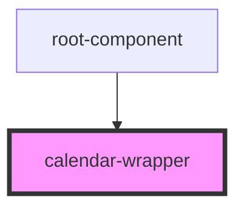

# calendar-wrapper

<!-- Auto Generated Below -->

## Properties

| Property     | Attribute | Description | Type                  | Default                                   |
| ------------ | --------- | ----------- | --------------------- | ----------------------------------------- |
| `handleDrop` | --        |             | `(data: any) => void` | `data => {     data.event.innerHtml;   }` |

## Methods

### `updateConfig(optionsOverride: any) => Promise<void>`

#### Returns

Type: `Promise<void>`

### `updateEvents(events: any, renderCallback?: any) => Promise<void>`

#### Returns

Type: `Promise<void>`

## Dependencies

### Used by

 - [root-component](../root-component)

### Graph

----------------------------------------------

*Built with [StencilJS](https://stenciljs.com/)*
