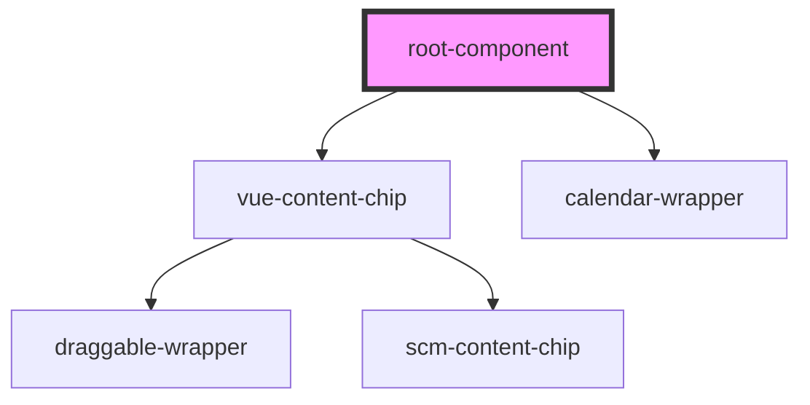

# root-component

<!-- Auto Generated Below -->

## Dependencies

### Depends on

- [vue-content-chip](../vue-content-chip)
- [calendar-wrapper](../calendar-wrapper)

### Graph

----------------------------------------------

*Built with [StencilJS](https://stenciljs.com/)*
