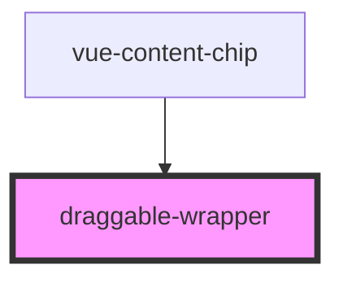

# draggable-wrapper

<!-- Auto Generated Below -->

## Properties

| Property | Attribute | Description | Type  | Default     |
| -------- | --------- | ----------- | ----- | ----------- |
| `data`   | `data`    |             | `any` | `undefined` |

## Methods

### `getData() => Promise<any>`

#### Returns

Type: `Promise<any>`

## Dependencies

### Used by

 - [vue-content-chip](../vue-content-chip)

### Graph

----------------------------------------------

*Built with [StencilJS](https://stenciljs.com/)*
